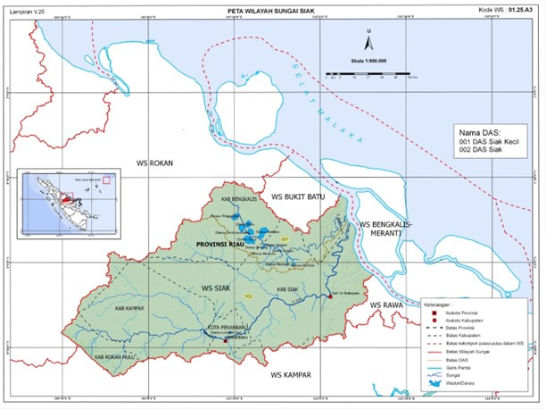

```{r setup, include=FALSE}
knitr::opts_chunk$set(echo = F)
knitr::opts_chunk$set(echo = params$printcode)
```

# Scope of Hydrological Analysis

## Background

This is an example of `r params$river_location` hydrological analysis.

Indonesia is highly prone to flooding due to climate change and topography. Flooding which occurs annually in most area of the country has been increasing in frequency, causing as much as $430 million in economic losses per year2. During 2003 -- 2017, the average annual flood impact have included 1,58 million people per year affected; 223,000 homes completely or partially damaged; and 137 hectares (ha) of field inundated. Water resilience is a central pillar of the RPJMN, which promotes Flood Risk Management to reduce flood damage. Indonesia adopted the integrated water resource management (IWRM) approach, which is being promoted through (i) the establishment of river basin management organizations (RBOs),4 and (ii) the formulation of strategic basin plans as a prerequisite to basin development plans (RENSTRA). The RENSTRA forms the basis for the public investment in water resource management with a horizon of 20 years, including flood management. Implementation of IWRM and participatory river basin management are still hampered by inadequate planning, investment, capacity, and coordination.

The `r params$name_ca` watershed has a height varying from 0 m above sea level to 525 m above sea level in the hills in the segment of the upstream watershed area, with a slope of 0-40%. While the area of critical land is more than 5000 km2. In the Siak watershed the river length from the furthest upstream of Tapung Kiri River to the mouth of the `r params$river_location` is ± `r params$length_river` km (Source: PSDA WS Siak Pattern 2013). While the `r params$river_location` crosses Siak Regency and Pekanbaru City as the capital of Riau Province. Pekanbaru City is located at an altitude of ± 5 meters above sea level, but Pekanbaru in the around of Sultan Syarif Kasim II Airport reaches 26 meters above sea level. Pekanbaru City is a lowland with a slope of 0-2% with alluvial, organosol and podsolic soils. The average annual rainfall in Pekanbaru is 2334.9 mm / year, the maximum daily rainfall occurs between 57--160 mm / day. Average monthly rainfall occurs between 119.72-254.12 mm / month (2014). Siak River which divides Pekanbaru City has a length of ± 56,825 km, width ± 50-150 meters, and a depth of ± 12-25 meters. In the city of Pekanbaru there are at least ± 30 main tributaries / drainage cities that empties into the Siak River in Pekanbaru City, with the main river's main river / city main drainage varying between ± 0.4-29 km.

The `r params$river_location` and its tributaries often overflow and cause floods that hit the city of Pekanbaru. The duration of inundation that occurs from 10 hours to 15 days with inundation height is at an altitude of 0.5 m to 2.5 meters. These floods mostly inundated residential housing, roads, public facilities, offices, and commercial areas. The biggest flood events occurred in 1985 and 1988 with flood inundation +4.60 meters and +4.40 meters, flooding occurred in almost all the banks of the Siak River and its tributary estuary. Whereas in November 2014 the flood inundation was +3.20 meters.

Balai Wilayah Sungai Sumatera III officially as the administer of the `r params$river_location` Territory has made serious efforts to address the problem of flooding and the destructive force of the water, namely the construction of a flood pump station in 4 (four) flood area sectors in Pekanbaru City which reduce flood risk by 13.24 km2 from 87.55 km2 (Various sources: 2015 Pekanbaru City Flood Report and 2013 Pola PSDA WS. Siak) as well as the construction of riverbank embankments and reinforcement in various locations.

## Objective

## Scope of work

## Location

## Codes and Standards Reference

# General Description

## Geographical Physical Condition

## Administrative Boundaries

## Characteristic of Siak River Basin

## Demographic conditions

## Topographic conditions

## Land Cover conditions

## Rainfall and Climate condition

### Rainfall

### Climate

# Rainfall Analysis

## Introduction

Complete data will produce a good analysis for rain analysis, where the rain analysis is the design rain analysis (1 day) for the calculation of the design flood discharge in the Siak River and its tributaries.

## Rainfall Data Collection

### Siak Watershed

Based on Appendix II of PERMEN PUPR NUMBER 04/PRT/M/2015 concerning Criteria and Determination of River Areas, the Siak River is part of the Siak River Watershed as shown in Figure 3.1. The Siak Watershed (DAS) has a watershed area of 11,521.56 sq.km.

<center>



</center>


# Hydrological Analysis

## PURPOSE OF THE HYDROLOGICAL ANALYSIS	

## 	ESTIMATION OF DESIGN RAINFALL	

###	Review Area Reduction Factor

###	Create Thiessen Polygons

###	Calculate of Areal Rainfall

###	Regional Rainfall Frequency Analysis

###	Determination Rainfall Duration and Distribution


## 	HYDROLOGICAL MODELING WITH HEC-HMS

###	 Characteristic Factors	

###	 Parameters	

##	EFFECTIVE RAINFALLl ESTIMATION	

###	SCS Curve-Number Method	


## HYDROLOGICAL MODELING	

###	Watershed Model	

###	Meteorological Model	

##	DETERMINATION THE DESIGN FLOOD	

###	Historical Flood Analysis	

###	Design Flood Analysis	


# Bibliography

<!-- This is an R Markdown document. Markdown is a simple formatting syntax for authoring HTML, PDF, and MS Word documents. For more details on using R Markdown see <http://rmarkdown.rstudio.com>. -->

<!-- When you click the **Knit** button a document will be generated that includes both content as well as the output of any embedded R code chunks within the document. You can embed an R code chunk like this: -->

<!-- ```{r cars} -->

<!-- summary(cars) -->

<!-- ``` -->

<!-- ## Including Plots -->

<!-- You can also embed plots, for example: -->

<!-- ```{r pressure, echo=FALSE} -->

<!-- plot(pressure) -->

<!-- ``` -->

<!-- Note that the `echo = FALSE` parameter was added to the code chunk to prevent printing of the R code that generated the plot. -->
